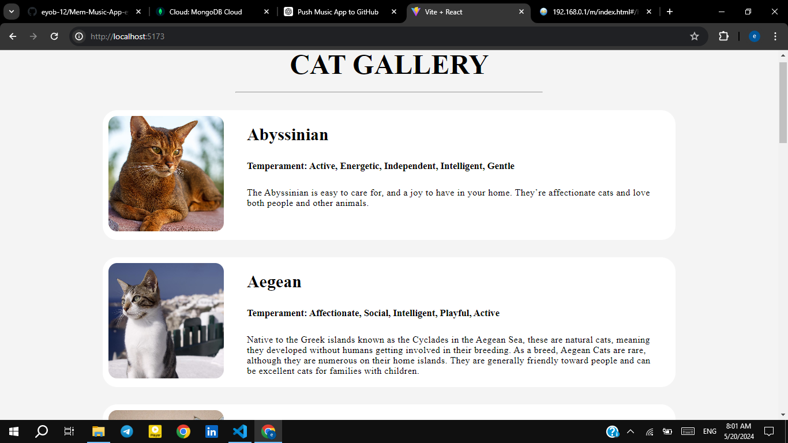

Cat Gallery App
Cat Gallery App is a web application that displays a gallery of cat images along with information about each cat breed. It utilizes TheCatAPI to fetch data about cat breeds and their images.

Features
Gallery Display ➡️ Displays a gallery of cat images along with breed information.
View More ➡️ Allows users to view more cat breeds.
Breed Details ➡️ Provides details about each cat breed, including temperament, origin, and description.
Technologies Used
Frontend
React.js ➡️ A JavaScript library for building user interfaces.
Redux Toolkit ➡️ A state management library for managing application state efficiently.
Redux Saga ➡️ A middleware library for handling asynchronous actions in Redux.
Axios ➡️ A promise-based HTTP client for making requests to the server.

Clone the repository:
git clone https://github.com/your-username/cat-gallery-app.git

Navigate to the project directory:

cd rtk-with-saga
Install dependencies:

yarn 
Start the development server:

yarn start

